# [Build CI/CD Pipeline Using GitHub Actions](https://www.youtube.com/watch?v=NppkHKvnrqc)

Tutorial tomado del canal de youtube **JavaTechie**.

---

## 📘 Introducción

En este tutorial aprenderemos a crear un pipeline de `CI/CD` utilizando `GitHub Actions`, una de las herramientas de
automatización más usadas actualmente para proyectos alojados en `GitHub`.

Antes de entrar en la práctica, es importante entender qué es `GitHub Actions` y por qué elegir esta herramienta
frente a otras alternativas de `CI/CD` existentes.

## ⚙️ ¿Qué es GitHub Actions?

`GitHub Actions` es una `plataforma de automatización integrada en GitHub` que permite construir, probar y desplegar
código directamente desde tu repositorio.

Permite crear `Workflows` (flujos de trabajo) definidos mediante archivos `YAML` dentro del directorio
`.github/workflows/`, los cuales se ejecutan automáticamente en respuesta a eventos como:

- `push`, `pull_request`
- Creación de tags o releases
- Schedules (cron jobs)
- Dispatch manual desde la UI
- Webhooks e integraciones externas

### 🧩 Características principales

- `Automatización completa`: CI/CD, linting, análisis estático, empaquetados, scripts, notificaciones, etc.
- `Ejecución en múltiples entornos`: Linux, Windows, macOS, contenedores y runners auto-hospedados.
- `Gigante marketplace de acciones reutilizables`: miles de acciones listas como `setup-java`,
  `docker/build-push-action`, `actions/checkout`, etc.
- `Integrado al 100% con GitHub`: sin configuraciones complicadas, sin servidores adicionales.
- `Escalabilidad inmediata`: GitHub provee runners bajo demanda.

#### 💡 Nota técnica

> `GitHub Actions` utiliza `runners`, que son máquinas virtuales donde se ejecutan los workflows. `GitHub`
> ofrece runners gratuitos para proyectos públicos y una cantidad de minutos para repos privados según el plan.

### 🎯 ¿Por qué usar GitHub Actions?

Probablemente, nos preguntemos por qué usar GitHub Actions teniendo tantas herramientas de CI/CD en el mercado, como:

- Jenkins
- GitLab CI
- TeamCity
- TravisCI
- Bamboo
- CircleCI

La respuesta se resume en este principio:
> Si tu repositorio está en `GitHub`, `GitHub Actions` elimina dependencias externas.

#### Ventajas clave

- 🚀 `Sin infraestructura adicional`: No necesitas mantener un servidor Jenkins o máquinas dedicadas.
- 🔄 `Configuración mínima`: Todo se versiona junto con el código (Workflows en YAML).
- 🧩 `Integración nativa`: Se conecta automáticamente a PRs, Issues, Releases y ramas.
- 💰 `Menos costo operativo`: GitHub ofrece runners gratuitos y no pagas por servidores externos.
- 📦 `Acciones reutilizables`: Evita escribir scripting complejo para tareas comunes.
- 🔒 `Seguridad integrada`: Secrets vault, permisos de jobs, OIDC para despliegues a la nube, etc.

En proyectos reales, `GitHub Actions` destaca especialmente para:

- Microservicios en Spring Boot que requieren builds rápidos.
- Pipelines containerizados (Docker, Kubernetes).
- Workflows de despliegue hacia AWS, Azure, GCP, Fly.io, Heroku u otros.
- Automatización de pruebas, linting, SonarQube, Snyk, etc.

### 🔧 Flujo de trabajo tradicional con Jenkins

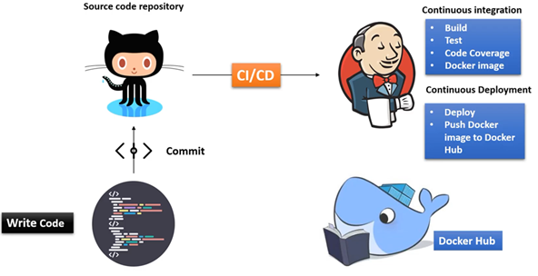

En el flujo tradicional con Jenkins, el proceso es:

- 🧑‍💻 El desarrollador escribe código.
- 📤 Hace push al repositorio en GitHub.
- 🔔 GitHub envía un `Webhook` a Jenkins.
- 🔄 Jenkins ejecuta las `etapas de CI`:
    - Compilación
    - Pruebas
    - Code coverage
    - Construcción de la imagen Docker

- 📦 Luego ejecuta las `etapas de CD`:
    - Despliegue
    - Push al registry (Docker Hub / ECR / GCR / etc.)

#### 🏗️ Problemas comunes en Jenkins

- Necesitas infraestructura propia (servidores o contenedores).
- Requiere mantenimiento, actualización de plugins, monitoreo.
- Es más complejo de escalar.
- El pipeline queda dependiente del servidor externo.

En entornos corporativos, Jenkins sigue siendo muy usado, pero requiere equipo DevOps que mantenga todo el sistema.

### 🔄 Flujo de trabajo con GitHub Actions

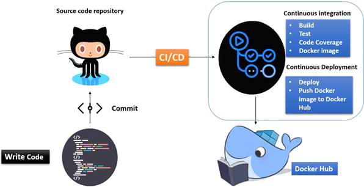

#### ¿Qué cambia?

- No necesitas infraestructura: GitHub provee los servidores.
- Los workflows se ejecutan `dentro de GitHub`, en runners automáticos.
- El pipeline CI/CD vive en el mismo repositorio donde está tu código.

#### 🧠 Ventajas reales en proyectos modernos

- `Menor complejidad operativa`: no configuras nada fuera de GitHub.
- `Velocidad`: los runners son rápidos y se crean bajo demanda.
- `Consistencia`: cada ejecución inicia desde un entorno limpio.
- `Integración perfecta con PRs`: revisiones automáticas, checks, deploy previews, etc.

#### Ejemplo real en empresas

Supongamos un microservicio Spring Boot que debe:

- Construirse con Maven
- Ejecutar tests
- Construir un Docker image
- Publicarlo a AWS ECR
- Desplegarlo en ECS o Kubernetes

Con `GitHub Actions`, todo este pipeline puede escribirse como un archivo YAML de ~50–80 líneas.
En `Jenkins`, tendrías que configurar un servidor, plugins, agentes, credenciales, pipelines, etc.

`GitHub Actions` reduce radicalmente el tiempo entre `push` → `build` → `deploy`.

## 🚀 Nuestro flujo de trabajo CI/CD (Visión general del tutorial)

En esta lección definiremos el `flujo completo que construiremos en el tutorial`, desde la creación del proyecto
hasta el despliegue automatizado utilizando `GitHub Actions`.

El objetivo es implementar un pipeline CI/CD que:

- Compile y pruebe nuestro proyecto de Spring Boot.
- Construya una imagen Docker.
- Publique dicha imagen en Docker Hub.

Todo esto será ejecutado automáticamente cada vez que realicemos cambios en el código.

### 🛠️ ¿Qué construiremos?

1. `Crearemos un proyecto Spring Boot`. Desarrollaremos un microservicio base (REST API simple) usando `Spring Boot`.
2. `Subiremos el proyecto a GitHub`. El repositorio alojará no solo el código fuente, sino también los workflows YAML
   que definen el pipeline.
3. `Configuraremos un workflow de GitHub Actions`. Desde la pestaña `Actions` crearemos un pipeline que se ejecutará en
   cada `push` o `pull_request`.
4. `Definiremos las etapas del pipeline`. GitHub Actions se encargará de automatizar:
    - 🧪 **1. Build & Test**
        - Descargar dependencias
        - Ejecutar pruebas unitarias
        - Generar artefactos del proyecto
    - 🐳 **2. Build Docker Image**
        - Construir una imagen Docker basada en nuestra aplicación
        - Etiquetarla usando el nombre del proyecto y/o el commit ID
    - 📤 **3. Push Image to Docker Hub**
        - Autenticarse contra Docker Hub usando GitHub Secrets
        - Subir la imagen generada al registry

### 🔄 Resultado final: pipeline CI/CD automatizado

Una vez configurado, `GitHub Actions` ejecutará este flujo de trabajo automáticamente cada vez que actualices tu
repositorio.

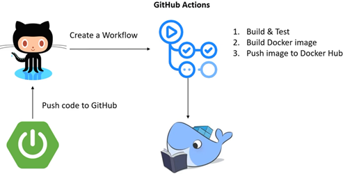

Con esto, obtendremos un pipeline completo que acompaña al código desde el desarrollo hasta la entrega.

## 🧱 1° paso: Creando el proyecto Spring Boot

Para comenzar con nuestro pipeline CI/CD, primero necesitamos un proyecto base sobre el cual trabajará GitHub Actions.
Crearemos un proyecto de Spring Boot usando
[Spring Initializr](https://start.spring.io/#!type=maven-project&language=java&platformVersion=3.5.8&packaging=jar&configurationFileFormat=yaml&jvmVersion=21&groupId=dev.magadiflo&artifactId=github-cicd-actions&name=github-cicd-actions&description=Demo%20project%20for%20Spring%20Boot&packageName=dev.magadiflo.app&dependencies=web,lombok),
con las dependencias mínimas necesarias para construir una API sencilla.

## 📦 Dependencias utilizadas

El proyecto usará una configuración ligera pero suficiente para la demostración del pipeline:

- `spring-boot-starter-web`. Para crear un servicio REST.
- `lombok`. Simplifica código boilerplate como getters, setters, constructores, etc.
- `spring-boot-starter-test`. Para ejecutar pruebas unitarias que se usarán en la etapa de CI.

````xml
<!--Spring Boot 3.5.8-->
<!--Java 21-->
<dependencies>
    <dependency>
        <groupId>org.springframework.boot</groupId>
        <artifactId>spring-boot-starter-web</artifactId>
    </dependency>

    <dependency>
        <groupId>org.projectlombok</groupId>
        <artifactId>lombok</artifactId>
        <optional>true</optional>
    </dependency>
    <dependency>
        <groupId>org.springframework.boot</groupId>
        <artifactId>spring-boot-starter-test</artifactId>
        <scope>test</scope>
    </dependency>
</dependencies>
````

## 🌐 Creando un endpoint sencillo

En esta lección construiremos una pequeña API REST con Spring Boot. Este endpoint será la base sobre la cual
ejecutaremos nuestro pipeline CI/CD con GitHub Actions (compilación, pruebas, construcción de imagen Docker,
despliegue, etc.).

La idea es mantener el servicio simple, pero funcional, como suele hacerse en pipelines de demostración o pruebas de
integración.

### ⚙️ Configuración de la aplicación

Agregamos una configuración mínima en el archivo `application.yml` para definir:

- Puerto de ejecución (8080)
- Manejo de mensajes de error
- Nombre lógico de la aplicación (útil para logs, observabilidad, etc.)

````yml
server:
  port: 8080
  error:
    include-message: always

spring:
  application:
    name: github-cicd-actions
````

### 🧪 Creando un endpoint REST básico

Ahora definimos un controlador sencillo que responderá con un saludo y algunos metadatos útiles:

- Mensaje de bienvenida
- Timestamp
- Versión del servicio

````java

@RestController
@RequestMapping(path = "/api/v1/greetings")
public class HelloController {
    @GetMapping
    public ResponseEntity<Map<String, Object>> hello() {
        var response = new HashMap<String, Object>();
        response.put("message", "Hola desde Spring Boot + GitHub Actions!");
        response.put("timestamp", LocalDateTime.now());
        response.put("version", "1.0.0");
        return ResponseEntity.ok(response);
    }
}
````

### 📌 Resultado esperado

````bash
$ curl -v http://localhost:8080/api/v1/greetings | jq
>
< HTTP/1.1 200
< Content-Type: application/json
< Transfer-Encoding: chunked
< Date: Thu, 11 Dec 2025 15:38:06 GMT
<
{
  "message": "Hola desde Spring Boot + GitHub Actions!",
  "version": "1.0.0",
  "timestamp": "2025-12-11T10:38:06.8277636"
}
````

## 📤 2° paso: Enviando el código fuente al repositorio de GitHub

Una vez creado nuestro proyecto Spring Boot, el siguiente paso es subir el código al repositorio remoto donde
construiremos nuestro pipeline CI/CD. En este caso, utilizaremos GitHub.

### Crear el repositorio en GitHub

Creamos un repositorio llamado `github-cicd-actions`, donde almacenaremos todo el proyecto junto con los workflows de
GitHub Actions.

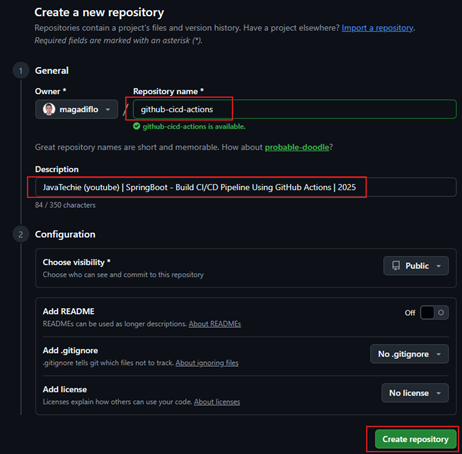

### Verificar el historial de commits local

Desde la consola, nos ubicamos en la raíz del proyecto para revisar el historial de cambios registrados hasta el
momento:

````bash
D:\programming\spring\02.youtube\25.java_techie\github-cicd-actions (main)
$ git lg
* 7999462 (HEAD -> main) Creando un endpoint sencillo
* 43da16b Creando el proyecto Spring Boot
* b572268 Nuestro flujo de trabajo CI/CD (Visión general del tutorial)
* 443597c Inicio
````

### Asociar el repositorio local con el repositorio remoto

Agregamos la URL del repositorio recién creado como origen (remote):

````bash
D:\programming\spring\02.youtube\25.java_techie\github-cicd-actions (main)
$ git remote add origin https://github.com/magadiflo/github-cicd-actions.git
````

Este comando crea un vínculo entre tu proyecto local y el repositorio de GitHub.

### Subir el proyecto al repositorio remoto (push)

Una vez configurado el remote, hacemos push del proyecto completo hacia GitHub:

````bash
D:\programming\spring\02.youtube\25.java_techie\github-cicd-actions (main)
$ git push -u origin main
Enumerating objects: 51, done.
Counting objects: 100% (51/51), done.
Delta compression using up to 8 threads
Compressing objects: 100% (36/36), done.
Writing objects: 100% (51/51), 266.13 KiB | 12.67 MiB/s, done.
Total 51 (delta 9), reused 0 (delta 0), pack-reused 0 (from 0)
remote: Resolving deltas: 100% (9/9), done.
To https://github.com/magadiflo/github-cicd-actions.git
 * [new branch]      main -> main
branch 'main' set up to track 'origin/main'. 
````

### Verificación en GitHub

Finalmente, refrescamos el repositorio en GitHub y confirmamos que todos los archivos del proyecto se hayan cargado
correctamente.

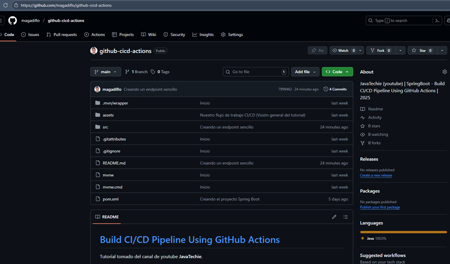

## ⚙️ 3° paso: Creando el Workflow de GitHub Actions

En este paso configuraremos nuestro primer workflow CI/CD dentro del repositorio de GitHub.
Este workflow será responsable de:

- Compilar el proyecto
- Ejecutar las pruebas
- Publicar el gráfico de dependencias

Este pipeline será la base sobre la cual luego añadiremos las etapas de Docker y despliegue continuo.

### 🧭 Navegando a GitHub Actions

Dentro del repositorio, abrimos la pestaña `Actions`. `GitHub` nos sugiere plantillas predefinidas llamadas `workflows`,
y entre ellas hay dos especialmente relevantes para proyectos Maven:

- `Java With Maven` — Plantilla estándar de CI
    - Esta plantilla está centrada en validar la calidad del código:
        - ✔ Compila el proyecto
        - ✔ Ejecuta todos los tests
        - ✔ Verifica que la rama está en buen estado
    - Es la plantilla base para pipelines que validan pull requests.

- `Publish Java Package With Maven` — Publicación de artefactos
    - Incluye todo lo anterior, pero además permite:
        - Publicar un `.jar` o `.war`
        - Subirlo a un registry como Maven Central, GitHub Packages u otro
    - Esta plantilla se usa cuando tu proyecto es una librería que otros consumirán.

### 🔒 Habilitar Dependency Graph

Antes de crear nuestro workflow, debemos activar una opción importante:

📍 `Settings` → `Security` → `Advanced Security` → `Dependency Graph`

Si no habilitamos esta opción, GitHub marcará un error durante el pull request porque el workflow actualizará el gráfico
de dependencias.

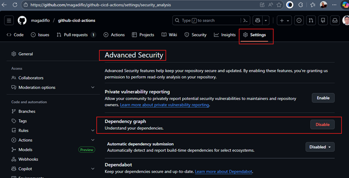

### 📝 Crear workflow con Java With Maven

Seleccionamos la plantilla `Java with Maven` y hacemos clic en `Configure`:

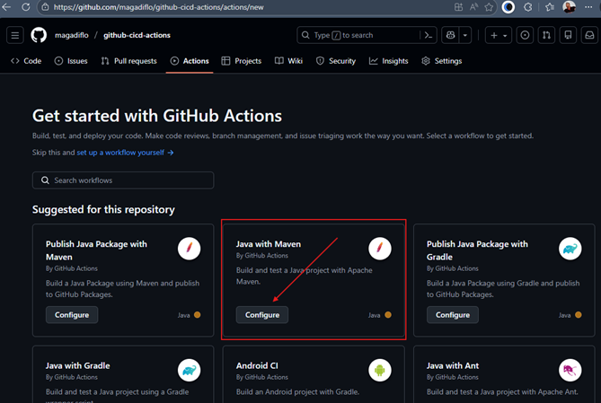

GitHub generará automáticamente un archivo llamado `maven.yml`. Nosotros lo ajustamos para adaptarlo a:

- Nombre personalizado
- Uso de Java 21
- Mejor claridad en los pasos
- Publicación del dependency graph

Aquí está el archivo final:

````yml
name: Project CI/CD Flow

on:
  push:
    branches: [ "main" ]
  pull_request:
    branches: [ "main" ]

jobs:
  build:

    runs-on: ubuntu-latest

    # Añadido: Permiso para que GITHUB_TOKEN pueda subir el gráfico de dependencias
    permissions:
      contents: write

    steps:
      - uses: actions/checkout@v4
      - name: Set up JDK 21
        uses: actions/setup-java@v4
        with:
          java-version: '21'
          distribution: 'temurin'
          cache: maven
      - name: Build with Maven
        run: mvn -B clean install

      # Optional: Uploads the full dependency graph to GitHub to improve the quality of Dependabot alerts this repository can receive
      # Este paso se ejecutará correctamente por la configuración permissions.contents=write y la habilitación del 
      # Dependency graph en el Advanced Security de el repositorio de GitHub
      - name: Update dependency graph
        uses: advanced-security/maven-dependency-submission-action@571e99aab1055c2e71a1e2309b9691de18d6b7d6
````

- 🏷️ `name: Project CI/CD Flow`. Nombre visible del workflow en GitHub Actions.
- Sección `on`. Define los eventos que disparan el workflow.
    - El pipeline se ejecutará en:
        - Cada *push* hacia `main`
        - Cada *pull request* que proponga cambios en `main`
    - Esto es típico para validar código antes de integrarlo a la rama principal.
- `jobs`: Todos los trabajos del pipeline, en este caso solo tenemos un job: `build`.
- `runs-on: ubuntu-latest`. GitHub ejecutará este pipeline en un runner de Ubuntu alojado en GitHub.
- `permissions.contents=write`. Es necesario para que GitHub pueda actualizar el gráfico de dependencias. Sin esto el
  workflow fallará.
- `steps`. Cada paso del job ejecuta una acción específica dentro del runner.
    - `uses: actions/checkout@v4`. Clona el código fuente del mismo repositorio donde se está ejecutando el workflow.
      Esto permite que los siguientes pasos (compilación, pruebas, análisis, construcción de Docker, etc.) puedan
      trabajar con el código del proyecto.
        - Por ejemplo, si el workflow está corriendo en `magadiflo/github-cicd-actions`, entonces `actions/checkout@v4`
          va a clonar ese repositorio `magadiflo/github-cicd-actions` dentro del runner de GitHub Actions.
- Configurar JDK 21.
    - Usa la distribución Temurin (LTS recomendada)
    - Activa la caché de Maven → acelera futuros builds
- Compilar y ejecutar pruebas
    - `-B` → modo batch (sin salida interactiva, ideal para CI)
- Actualizar dependency graph
    - Este paso envía la lista de dependencias a GitHub.
    - Sirve para:
        - Alertas de seguridad
        - Dependabot
        - Auditorías

Presionamos en `Commit changes...`

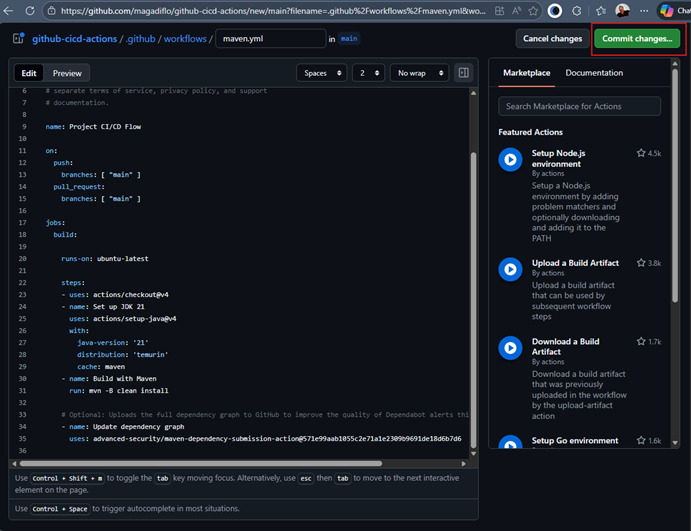

Seleccionamos `Crate a new branch for this commit and start a pull request` para crear este archivo en otra rama.

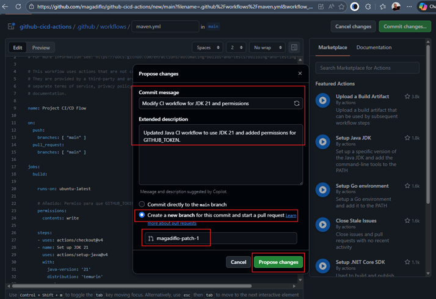

### 🔄 Crear el Pull Request

Una vez terminado el YAML, hacemos clic en:

- ✔ Commit changes
- ✔ Create a new branch and start a pull request

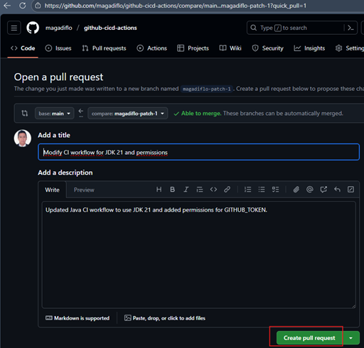

Luego fusionamos los cambios en la rama `main`:

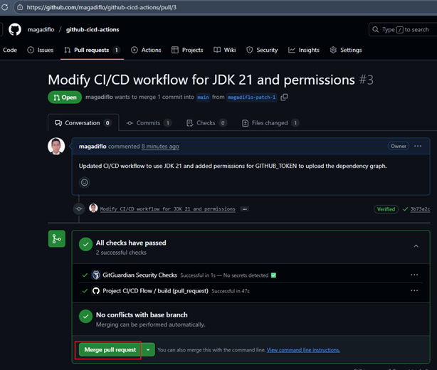

Finalmente, vemos el archivo `maven.yml` dentro de: `.github/workflows/maven.yml`.

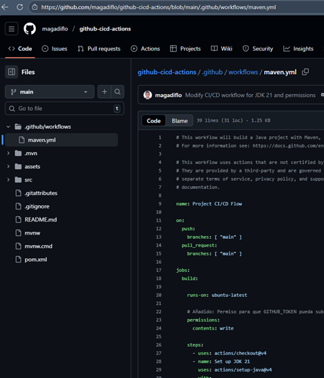

### 🔻 Actualizar el repositorio local

Traemos la última versión desde GitHub:

````bash
D:\programming\spring\02.youtube\25.java_techie\github-cicd-actions (main -> origin)
$ git pull origin main
remote: Enumerating objects: 7, done.
remote: Counting objects: 100% (7/7), done.
remote: Compressing objects: 100% (4/4), done.
remote: Total 6 (delta 1), reused 0 (delta 0), pack-reused 0 (from 0)
Unpacking objects: 100% (6/6), 2.67 KiB | 182.00 KiB/s, done.
From https://github.com/magadiflo/github-cicd-actions
 * branch            main       -> FETCH_HEAD
   47eadce..0cc30b6  main       -> origin/main
Updating 47eadce..0cc30b6
Fast-forward
 .github/workflows/maven.yml | 39 +++++++++++++++++++++++++++++++++++++++
 1 file changed, 39 insertions(+)
 create mode 100644 .github/workflows/maven.yml
````

### 🧭 Verificar historial de commits

````bash
D:\programming\spring\02.youtube\25.java_techie\github-cicd-actions (main -> origin)
$ git lg
*   0cc30b6 (HEAD -> main, origin/main, origin/HEAD) Merge pull request #3 from magadiflo/magadiflo-patch-1
|\
| * 3b73a2c (origin/magadiflo-patch-1) Modify CI/CD workflow for JDK 21 and permissions
|/
* 47eadce 2° paso: Enviando el código fuente al repositorio de GitHub
* 7999462 Creando un endpoint sencillo
* 43da16b Creando el proyecto Spring Boot
* b572268 Nuestro flujo de trabajo CI/CD (Visión general del tutorial)
* 443597c Inicio 
````

Revisamos nuestros archivos en nuestro proyecto y vemos: `.github` > `workflows` > `maven.yml`, vemos que se ha
descargado correctamente.

